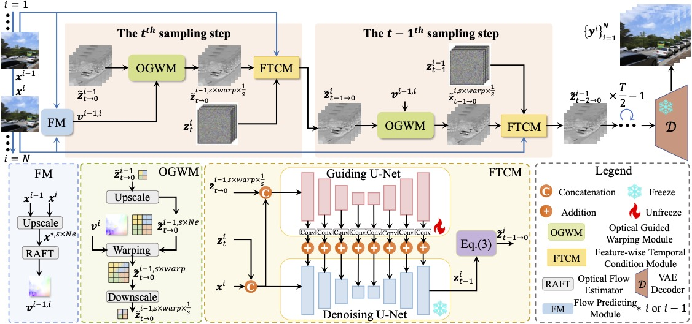

## DGAF-VSR: Rethinking Diffusion Model-Based Video Super-Resolution: Leveraging Dense Guidance from Aligned Features(CVPR 2026)    
[Jingyi Xu](https://github.com/JingyiXu404)<sup>\*</sup>, [Meisong Zheng](https://github.com/tszssong)<sup>\*</sup>, Ying Chen<sup>+</sup>, [Minglang Qiao](https://github.com/MinglangQiao), Xin Deng<sup>+</sup>, Mai Xu, "DGAF-VSR: Rethinking Diffusion Model-Based Video Super-Resolution: Leveraging Dense Guidance from Aligned Features", CVPR, 2026  
[arxiv](https://arxiv.org/abs/2511.16928)  

---

**Abstract:** Diffusion model (DM) based Video Super-Resolution (VSR) approaches achieve impressive perceptual quality. However, existing DM-based VSR methods over-prioritize perceptual synthesis while neglecting fidelity gains from accurate alignment and sufficient compensation. In this paper, within the DM-based VSR pipeline, we revisit the role of
alignment and compensation between adjacent video frames and reveal two crucial observations: (a) the feature domain is better suited than the pixel domain for information compensation due to its stronger spatial and temporal correlations, and (b) warping at an upscaled resolution better preserves high-frequency information, but this benefit is not necessarily monotonic. Therefore, we propose a novel Densely Guided diffusion model with Aligned Features for Video Super-Resolution (DGAF-VSR), with an Optical Guided Warping Module (OGWM) to maintain highfrequency details in the aligned features and a Featurewise Temporal Condition Module (FTCM) to deliver dense guidance in the feature domain. Extensive experiments on synthetic and real-world datasets demonstrate that DGAFVSR surpasses state-of-the-art methods in key aspects of VSR, including perceptual quality (35.82% DISTS reduction), fidelity (0.20 dB PSNR gain), and temporal consistency (30.37% tLPIPS reduction).  
  

---

### Test   
#### prepare  
Download the pretrained models: 
```
tar xzf assets.tar.gz
mkdir ckpts  
tar xzf DGAF_VSR.tar.gz -C ckpts 
```
#### REDS4  
```
sh test_reds4.sh   
```
- Results:  
```
PSNR: 28.17, SSIM: 0.804, LPIPS: 0.095, DISTS: 0.043, MUSIQ: 67.9, CLIP: 0.429, NIQE: 2.66, tLPIPS: 3.92, tOF: 2.714  
000: PSNR=24.978, SSIM=0.718, LPIPS=0.104, DISTS=0.050, MUSIQ=73.538, CLIP=0.565, NIQE=2.740, tLPIPS=7.824, tOF=0.819  
011: PSNR=29.110, SSIM=0.810, LPIPS=0.101, DISTS=0.041, MUSIQ=63.744, CLIP=0.402, NIQE=2.387, tLPIPS=2.747, tOF=1.206  
015: PSNR=31.514, SSIM=0.875, LPIPS=0.076, DISTS=0.043, MUSIQ=68.030, CLIP=0.372, NIQE=3.132, tLPIPS=2.011, tOF=6.917  
020: PSNR=27.087, SSIM=0.813, LPIPS=0.099, DISTS=0.039, MUSIQ=66.301, CLIP=0.379, NIQE=2.386, tLPIPS=3.096, tOF=1.914 
```      
- Tesla V100-32G Overhead:   
```
GPU Memory: 16572MiB / 32510MiB   
Time Cost: 100%|███████████████████████| 5000/5000 [37:07<00:00,  2.24it/s]  
```
#### Vid4  
```
sh test_vid4.sh  
```
- Results:  
```
PSNR: 24.75, SSIM: 0.714, LPIPS: 0.175, DISTS: 0.113, MUSIQ: 67.95, CLIP: 0.47, NIQE: 3.1, tLPIPS: 17.38, tOF: 0.688   
calendar: PSNR=22.063, SSIM=0.7168, LPIPS=0.2037, DISTS=0.1338, MUSIQ=70.9346, CLIP=0.6362, NIQE=3.0734, tLPIPS=8.6251, tOF=0.3649   
city: PSNR=26.075, SSIM=0.6959, LPIPS=0.2012, DISTS=0.1102, MUSIQ=67.4635, CLIP=0.5162, NIQE=2.8076, tLPIPS=18.4669, tOF=0.5047   
foliage: PSNR=23.264, SSIM=0.6046, LPIPS=0.1935, DISTS=0.1241, MUSIQ=68.4496, CLIP=0.3833, NIQE=3.5511, tLPIPS=24.3791, tOF=0.4647   
walk: PSNR=27.585, SSIM=0.8384, LPIPS=0.1028, DISTS=0.0825, MUSIQ=64.9557, CLIP=0.3444, NIQE=2.9702, tLPIPS=18.0485, tOF=1.4180   
``` 
- Tesla V100-32G Overhead:   
```
GPU Memory: 9684MiB / 32510MiB   
Time Cost: 100%|███████████████████████| 2050/2050 [07:30<00:00,  4.55it/s]    
```
---
### Train
```
sh train_reds.sh
```
- Tesla V100-32G Overhead:
```
GPU Memory: 19252MiB / 32510MiB  
Time Cost:  
Epoch 0: GS 0, Steps: 832it [17:46,  1.28s/it, loss=0.14, lr=5e-5]  
Epoch 1: GS 832, Steps: 832it [17:45,  1.28s/it, loss=0.151, lr=5e-5]  
Epoch 2: GS 1664, Steps: 832it [17:47,  1.28s/it, loss=0.183, lr=5e-5]
Epoch 3: GS 2496, Steps: 832it [17:48,  1.28s/it, loss=0.145, lr=5e-5]  
Epoch 4: GS 3328, Steps: 832it [17:47,  1.28s/it, loss=0.169, lr=5e-5]   
Epoch 5: GS 4160, Steps: 832it [17:47,  1.28s/it, loss=0.162, lr=5e-5]  
Epoch 6: GS 4992, Steps:  78%|███████████████  | 651/831 [13:55<03:50,  1.28s/it, loss=0.135, lr=5e-5] 
``` 
--- 
### Enverionment   
```
conda create -n diffusers python=3.9 -y
conda activate diffusers
python -m pip install --upgrade pip
pip install torch==1.12.1+cu116 torchvision==0.13.1+cu116 torchaudio==0.12.1 --extra-index-url https://download.pytorch.org/whl/cu116
cd  examples/dgaf 
pip install -r requirements.txt  
cd ../..
pip install -e .  
```
---
### Citation  
If you find the code helpful in your research or work, please cite the following paper(s).
```
@misc{xu2025rethinkingdiffusionmodelbasedvideo,
      title={Rethinking Diffusion Model-Based Video Super-Resolution: Leveraging Dense Guidance from Aligned Features}, 
      author={Jingyi Xu and Meisong Zheng and Ying Chen and Minglang Qiao and Xin Deng and Mai Xu},
      year={2025},
      eprint={2511.16928},
      archivePrefix={arXiv},
      primaryClass={cs.CV},
      url={https://arxiv.org/abs/2511.16928}, 
}
```
---
### Acknowledgement  
This code is based on [BrushNet](https://github.com/TencentARC/BrushNet), [StableVSR](https://github.com/claudiom4sir/StableVSR), and [diffusers](https://github.com/huggingface/diffusers). Thanks for their awesome work.